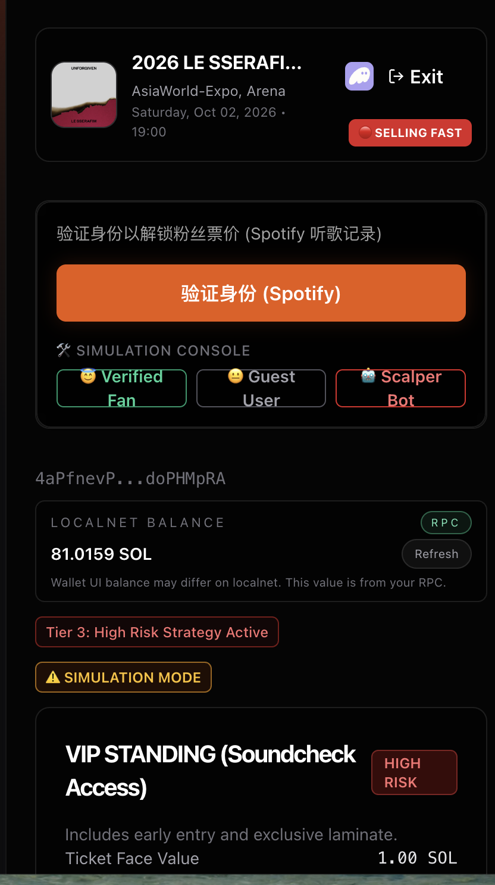
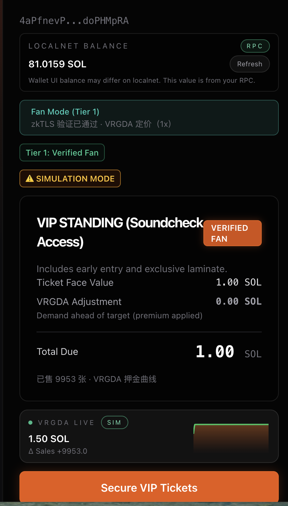
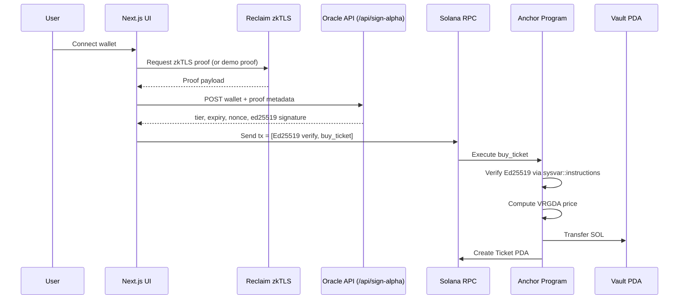

# UNFORGIVEN — Algorithmic Fair Launch Protocol

zkTLS‑powered VRGDA anti‑bot engine on Solana. Built for fair launches and liquidity protection on RobinPump‑style launchpads.

## Project Demo & Walkthrough

- Demo video: [WATCH THE DEMO](https://drive.google.com/file/d/1PSPqrUUWT2BgotC07PxqSDEscLxk5VM2/view?usp=sharing)  
  Note: If Google Drive is still processing, please click the blue \"Download\" button to watch.  
- Loom walkthrough (audio): [WATCH THE FULL DEMO & CODE EXPLANATION](https://drive.google.com/file/d/1IqxI9ay85bGh1YTMkAiAbLMKQPGyZbiw/view?usp=sharing)  


## Product Screenshots

Screenshots are stored under `docs/screenshots/`.

- 
- 
- 
- 

## The Problem — Launchpad Efficiency Crisis

On fast launchpads, the first few hundred milliseconds decide who gets supply.

- Bot sniping drains liquidity instantly.
- Value leakage: a large share of launch value is extracted by MEV bots, not the community.
- Real users face massive slippage and unfair access.

## Our Solution — The “J‑Curve” Firewall

UNFORGIVEN replaces static pricing with a **time‑dependent bonding curve** (VRGDA‑style) plus **identity‑weighted access**.

- **Algorithmic pricing:** if sales velocity exceeds target rate, price rises quickly (J‑Curve‑like spike); if demand cools, it relaxes.
- **Identity weighting:** verified humans (via zkTLS) receive protected, face‑value access tiers.
- **Capital efficiency:** bot premiums accumulate in the vault/treasury, strengthening protocol liquidity.

## Technical Architecture & Interaction Logic

**Interaction flow**



**What happens on‑chain**

- **PDA state:** `GlobalState`, `Vault`, `Ticket` accounts are deterministic and collision‑free.
- **VRGDA‑style pricing:**  
  `target_sold = (now - start_time) * target_rate`  
  `sales_difference = items_sold - target_sold`  
  `modifier = clamp(sales_difference * decay_constant, +/- max_bps)`  
  `vrgda_price = base_price * (1 + modifier)`  
  `final_price = vrgda_price * 10000 / alpha` (tier‑discount)
- **Ed25519 instruction introspection:** the program confirms an Ed25519 verification instruction ran in the same tx using `sysvar::instructions`.
- **Oracle‑signed authorization:** `/api/sign-alpha` signs `AuthorizationPayload`  
  (`buyer_pubkey`, `event_id`, `tier_level`, `expiry`, `nonce`) which the program verifies on‑chain.

## Repo Structure

```
programs/unforgiven/     # Anchor program (VRGDA + instruction introspection)
app/                     # Next.js frontend + API routes
  api/sign-alpha/        # Oracle signing endpoint (Ed25519)
components/              # IdentityVerifier, JCurveChart, UI modules
hooks/                   # Web3 hooks (useBuyTicket)
app/utils/vrgda.ts       # Client-side VRGDA simulation for charts
tests/                   # Anchor tests (if added)
Anchor.toml              # Program config
```

## How to Run Locally

```bash
# 1. Install dependencies
npm install

# 2. Start local validator
solana-test-validator

# 3. Build & deploy program
anchor build && anchor deploy

# 4. Run frontend
npm run dev
```

## Hackathon Tracks

- **DeFi Track:** Optimize launch efficiency and liquidity protection for RobinPump assets.
- **Partner Perks:** CoinGecko API integration and Solana stack.
