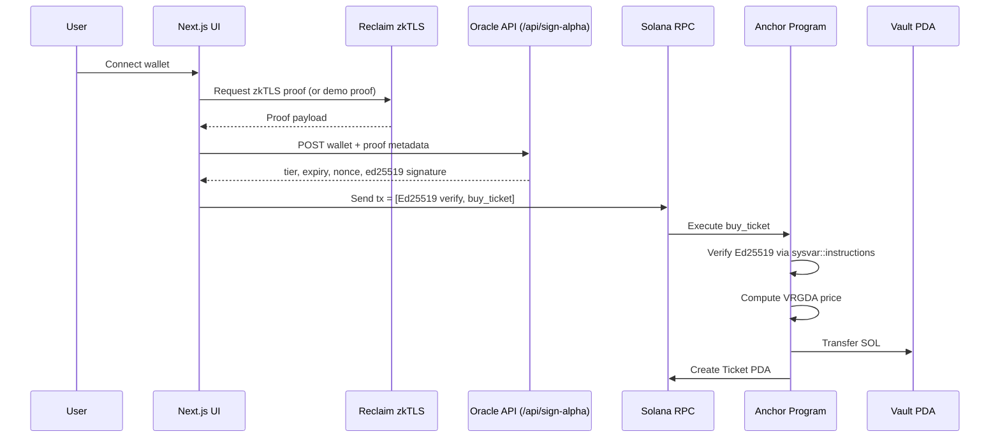

# UNFORGIVEN — Algorithmic Fair Launch Protocol

zkTLS‑powered VRGDA anti‑bot engine on Solana. Built for fair launches and liquidity protection on RobinPump‑style launchpads.

## Version Split (v1 / v2)

- v1 (ticketing app): `/Users/lenovo/Desktop/HACKTHON PROJECT/programs/unforgiven`
- v2 (universal middleware): `/Users/lenovo/Desktop/HACKTHON PROJECT/programs/unforgiven_v2`
- v2 SDK scaffold: `/Users/lenovo/Desktop/HACKTHON PROJECT/packages/universal-shield-sdk`
- v2 demo scaffold: `/Users/lenovo/Desktop/HACKTHON PROJECT/apps/kickstart-demo`
- Full routing guide: `/Users/lenovo/Desktop/HACKTHON PROJECT/docs/VERSION_MAP.md`

## Project Demo & Walkthrough

- Demo video: [WATCH THE DEMO](https://drive.google.com/file/d/1PSPqrUUWT2BgotC07PxqSDEscLxk5VM2/view?usp=sharing)  
  ⚠️ **Note for Judges:** If Google Drive is still processing the video and shows an error screen, please click the blue **"Download"** button to watch the high-quality `.mov` file(The video file has also been directly uploaded via the official EasyA submission form).  
- Loom walkthrough (audio): [WATCH THE FULL DEMO & CODE EXPLANATION](https://drive.google.com/file/d/1IqxI9ay85bGh1YTMkAiAbLMKQPGyZbiw/view?usp=sharing)  


## Product Screenshots

Screenshots are stored under `docs/screenshots/`.

- 
- 
- 
- 

## The Problem — Launchpad Efficiency Crisis

On fast launchpads, the first few hundred milliseconds decide who gets supply.

- Bot sniping drains liquidity instantly.
- Value leakage: a large share of launch value is extracted by MEV bots, not the community.
- Real users face massive slippage and unfair access.

## Our Solution — The “J‑Curve” Firewall

UNFORGIVEN replaces static pricing with a **time‑dependent bonding curve** (VRGDA‑style) plus **identity‑weighted access**.

- **Algorithmic pricing:** if sales velocity exceeds target rate, price rises quickly (J‑Curve‑like spike); if demand cools, it relaxes.
- **Identity weighting:** verified humans (via zkTLS) receive protected, face‑value access tiers.
- **Capital efficiency:** bot premiums accumulate in the vault/treasury, strengthening protocol liquidity.

## Technical Architecture & Interaction Logic

**Interaction flow**



**What happens on‑chain**

- **PDA state:** `GlobalState`, `Vault`, `Ticket` accounts are deterministic and collision‑free.
- **VRGDA‑style pricing:**  
  `target_sold = (now - start_time) * target_rate`  
  `sales_difference = items_sold - target_sold`  
  `modifier = clamp(sales_difference * decay_constant, +/- max_bps)`  
  `vrgda_price = base_price * (1 + modifier)`  
  `final_price = vrgda_price * 10000 / alpha` (tier‑discount)
- **Ed25519 instruction introspection:** the program confirms an Ed25519 verification instruction ran in the same tx using `sysvar::instructions`.
- **Oracle‑signed authorization:** `/api/sign-alpha` signs `AuthorizationPayload`  
  (`buyer_pubkey`, `event_id`, `tier_level`, `expiry`, `nonce`) which the program verifies on‑chain.

## Repo Structure

```
programs/unforgiven/     # Anchor program (VRGDA + instruction introspection)
app/                     # Next.js frontend + API routes
  api/sign-alpha/        # Oracle signing endpoint (Ed25519)
components/              # IdentityVerifier, JCurveChart, UI modules
hooks/                   # Web3 hooks (useBuyTicket)
app/utils/vrgda.ts       # Client-side VRGDA simulation for charts
tests/                   # Anchor tests (if added)
Anchor.toml              # Program config
```

## How to Run Locally

```bash
# 1. Install dependencies
npm install

# 2. Start local validator
solana-test-validator
# macOS workaround if you see "extra entry found: ._genesis.bin"
COPYFILE_DISABLE=1 solana-test-validator --reset

# 3. Build & deploy program
anchor build && anchor deploy

# 4. Run frontend
npm run dev
```

### v2 One-Liner Trigger (No `rg` Dependency)

```bash
cd "/Users/lenovo/Desktop/HACKTHON PROJECT" && (lsof -ti tcp:3100 >/dev/null || (npm run dev -- -p 3100 >/tmp/wanwan-dev-3100.log 2>&1 &)) && for i in $(seq 1 40); do curl -s http://127.0.0.1:3100/api/oracle-pubkey | grep -q 'oraclePubkey' && break; sleep 1; done && out="$(SHIELD_API_BASE=http://127.0.0.1:3100 node ./scripts/trigger_preview_v2.js 2>&1)"; echo "$out"; tx="$(printf '%s\n' "$out" | sed -n 's/^previewPrice tx: //p' | tail -1)"; [ -n "$tx" ] && solana confirm -v "$tx" --url http://127.0.0.1:8899 || echo "未提取到 previewPrice tx（看 /tmp/wanwan-dev-3100.log）"
```
`next dev` 启动日志：`/tmp/wanwan-dev-3100.log`

### v2 Admin Guardrail Reset

```bash
cd "/Users/lenovo/Desktop/HACKTHON PROJECT"
SHIELD_API_BASE=http://127.0.0.1:3100 node ./scripts/reset_admin_v2.js
```

### Sentinel v2 (Cargo Crate)

```bash
cd "/Users/lenovo/Desktop/HACKTHON PROJECT"
RUST_LOG=sentinel_service_v2=debug cargo run -p sentinel-service-v2 -- configs/sentinel_config_v2.toml
```

### v2 One-Command Ops (Recommended)

```bash
cd "/Users/lenovo/Desktop/HACKTHON PROJECT"
bash scripts/demo_v2.sh 40
```

只开一个终端即可。`demo_v2.sh` 会自动拉起本地链（validator）、部署合约、启动 API 和 Sentinel。

Shutdown:

```bash
cd "/Users/lenovo/Desktop/HACKTHON PROJECT"
bash scripts/down_v2.sh --clean-ledger
```

Status:

```bash
cd "/Users/lenovo/Desktop/HACKTHON PROJECT"
bash scripts/status_v2.sh
```

Use production-like Sentinel thresholds:

```bash
cd "/Users/lenovo/Desktop/HACKTHON PROJECT"
SENTINEL_CONFIG=configs/sentinel_config_v2.toml bash scripts/up_v2.sh
```

Use production-like startup + strict Oracle key:

```bash
cd "/Users/lenovo/Desktop/HACKTHON PROJECT"
npm run oracle:keygen:v2
export ORACLE_KEYPAIR_PATH="/Users/lenovo/Desktop/HACKTHON PROJECT/.keys/oracle-v2.json"
export ORACLE_REQUIRE_STATIC_KEY=1
npm run up:v2:prod
```

Ops smoke (full validation + JSON report):

```bash
cd "/Users/lenovo/Desktop/HACKTHON PROJECT"
bash scripts/ops_smoke_v2.sh 40
```

Report paths:
- `/tmp/wanwan-ops-smoke-report.json`
- `/tmp/wanwan-ops-smoke-report-<run_id>.json`

Report schema keys (stable):
- `schema_version`, `run_id`, `result`, `failure_step`, `artifact_tgz`
- `governance_tx_signature`, `reset_tx_signature`, `baseline_hash_hex`, `onchain_hash_hex_after_reset`, `hash_changed_before_reset`

### 唯一验收命令（Strict Gate）

```bash
cd "/Users/lenovo/Desktop/HACKTHON PROJECT"
npm run gate:all
```

`gate:all` = `ci:gate` + `smoke:ops:v2`。  
通过后可视为主线可继续；失败时必须查看 artifact 包。

Failure artifact archive:
- On any `ops_smoke_v2.sh` failure, logs are auto-packed to:
  `/tmp/wanwan-ops-smoke-artifacts-<run_id>.tar.gz`
- Latest artifact symlink:
  `/tmp/wanwan-ops-smoke-artifacts-latest.tar.gz`
- Optional knobs:
  - `AUTO_DOWN=0` keep services running after smoke
  - `ALWAYS_ARCHIVE=1` archive even on success
  - `FORCE_FAIL_STEP=status` force failure for archive-drill

Security toggles:
- Emergency freeze: `SHIELD_FREEZE=1` (returns 503 on `/api/shield-score`)
- Rate limits:
  - `SHIELD_RATE_WINDOW_SECS` (default 60)
  - `SHIELD_RATE_LIMIT_PER_IP` (default 120)
  - `SHIELD_RATE_LIMIT_PER_WALLET` (default 60)
  - `SHIELD_RATE_LIMIT_REQUIRE_REDIS=1` (optional; fail closed with 503 if Redis is unavailable)
  - `SHIELD_TRUST_PROXY_HEADERS=1` (optional; trust `x-forwarded-for`/`x-real-ip` only when behind trusted proxy)
- Strict Oracle key mode:
  - `ORACLE_REQUIRE_STATIC_KEY=1`
  - key from `ORACLE_PRIVATE_KEY` or `ORACLE_KEYPAIR_PATH`
  - production defaults to strict static key unless `ORACLE_ALLOW_EPHEMERAL_IN_PRODUCTION=1`
- Reclaim hardened verify (server-side):
  - `RECLAIM_ALLOWED_PROVIDERS=...` (optional allowlist, comma-separated)
  - `RECLAIM_REQUIRE_CONTEXT_MATCH=1` (default; set `0` only for controlled debugging)
- Replay protection storage:
  - `REDIS_URL=redis://127.0.0.1:6379` (recommended for multi-instance)
  - `RECLAIM_REPLAY_PREFIX=reclaim:proof-id` (default key prefix)
  - `RECLAIM_REPLAY_TTL_SECONDS=300` (default)

Protocol hard constraints (v2):
- Init permissions are upgrade-authority-gated:
  - `initialize_v2` and `initialize_admin_config` require `program_data.upgrade_authority_address == authority`
  - This removes permissionless first-writer initialization on fixed PDAs.
- VRGDA input age ceiling:
  - `time_elapsed` must be `<= 30 days` (`MAX_TIME_ELAPSED_SECS = 2,592,000`)
  - Inputs beyond ceiling fail with `InvalidTimeElapsed` (not infinity fallback).

### 评审 3 分钟演示剧本

```bash
cd "/Users/lenovo/Desktop/HACKTHON PROJECT"
npm run up:v2
NODE_NO_WARNINGS=1 SHIELD_API_BASE=http://127.0.0.1:3100 node ./scripts/burst_preview_v2.js 40
NODE_NO_WARNINGS=1 SHIELD_API_BASE=http://127.0.0.1:3100 node ./scripts/reset_admin_v2.js
npm run down:v2
```

Notes:
- `configs/sentinel_config_v2.toml` is production-like (high thresholds); it may not trigger governance during small bursts.
- `configs/sentinel_config_v2.demo.toml` is demo mode (low thresholds); it should trigger governance within ~40 previews.
- If you see validator error `extra entry found: ._genesis.bin`, you must start it with `COPYFILE_DISABLE=1` (the scripts do this).

Troubleshooting:
- `ECONNREFUSED 127.0.0.1:3100`: Next dev API not running. Run `bash scripts/up_v2.sh` and check `/tmp/wanwan-next-3100.log`.
- Sentinel stuck at `connected to Solana pubsub` with no further logs: normal at `info` level. Use `RUST_LOG=sentinel_service_v2=debug` to see per-event receipts.
- `DEP0040 punycode` spam in loop scripts: default scripts now suppress deprecation noise. To re-enable for debugging use `SHOW_NODE_DEPRECATION=1`.

Log grep templates:
- Oracle issue logs: `grep -E '"event":"shield_score_issued".*"wallet".*"nonce".*"tier".*"blocked".*"price_lamports"' /tmp/wanwan-next-3100.log | tail -n 20`
- Trigger/Burst result logs: `grep -E '"event":"preview_trigger_result"|"event":"preview_burst_result"' /tmp/wanwan-ops-smoke-preview.log /tmp/wanwan-ops-smoke-burst.log 2>/dev/null | tail -n 20`
- Sentinel governance logs: `grep -E 'attack assessment triggered|governance action submitted|admin_config active_scoring_model_hash verified' /tmp/wanwan-sentinel-v2.log | tail -n 30`

Monitoring quick check:
- `npm run alerts:v2`

Hardening playbook:
- `/Users/lenovo/Desktop/HACKTHON PROJECT/docs-private/v2/HARDENING_PLAYBOOK.md` (local-only, gitignored)

Integration blueprint:
- `/Users/lenovo/Desktop/HACKTHON PROJECT/docs-private/v2/INTEGRATION_BLUEPRINT.md` (local-only, gitignored)
- Example plugin: `/Users/lenovo/Desktop/HACKTHON PROJECT/examples/anti-bot-ticket-plugin/index.js`
- Plugin manifest template: `/Users/lenovo/Desktop/HACKTHON PROJECT/examples/anti-bot-ticket-plugin/plugin.manifest.template.json`

Interview cram (CN):
- `/Users/lenovo/Desktop/HACKTHON PROJECT/docs-private/v2/INTERVIEW_CRAM_CN.md` (local-only, gitignored)

### Safety / Consistency Gates

```bash
cd "/Users/lenovo/Desktop/HACKTHON PROJECT"
npm run check:program-id
npm run check:getrandom-patch
npm run smoke:tx-builder:v2
```

## Hackathon Tracks

- **DeFi Track:** Optimize launch efficiency and liquidity protection for RobinPump assets.
- **Partner Perks:** CoinGecko API integration and Solana stack.
