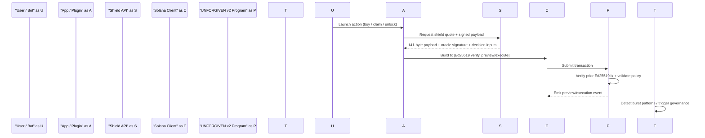

# UNFORGIVEN v2

Universal fairness middleware for high-velocity Solana launches.

UNFORGIVEN v2 combines zkTLS-backed user weighting, on-chain verifiable authorization, and operational guardrails to reduce bot extraction while keeping integration simple for launch and access flows.

## Why

Fast launches break fairness first:

- bot bursts distort price discovery
- real users get worse execution and access
- static allowlists and static pricing are easy to game

UNFORGIVEN v2 provides a **Shield-first** path that can be enforced on-chain, not only at the UI/API layer.

## How It Works

1. **Shield API**
   - verifies Reclaim/zkTLS proofs (server-side)
   - maps user signals to a dignity score / adapter mask
   - returns a deterministic signed payload

2. **Client transaction (2 instructions)**
   - `Ed25519Program.verify`
   - `UNFORGIVEN v2 preview/execute instruction`

3. **On-chain enforcement**
   - validates the prior Ed25519 instruction via `sysvar::instructions`
   - applies policy checks and pricing logic
   - separates `preview_price` (repeatable UX path) from `execute_shield` (one-time proof consumption path)

4. **Operations / response**
   - Sentinel watches preview events
   - governance actions can be triggered on burst patterns
   - reset flow and smoke report validate recovery

## Quick Validation

Run the strict end-to-end gate:

```bash
npm run gate:all
```

This validates:
- checks + tests + tx-builder smoke
- local stack boot (validator + API + sentinel)
- preview burst flow
- governance action submission
- admin reset
- post-reset preview sanity

Generated report:
- `/tmp/wanwan-ops-smoke-report.json`

## Architecture (v2 Core Flow)



## Integration Surface

UNFORGIVEN v2 is designed as middleware, not a single app.

Standard handshake returned by Shield API:
- `payload_hex` (fixed 141-byte payload)
- `oracle_signature_hex` (Ed25519 signature)
- `oracle_pubkey`

Client transaction model:
- `Ed25519Program.verify`
- `UNFORGIVEN v2 preview/execute instruction`

Integration assets:
- SDK: `packages/universal-shield-sdk`
- Payload spec: `docs/v2/PAYLOAD_V0_SPEC.md`
- Example plugin: `examples/anti-bot-ticket-plugin/index.js`

## Demo Verticals (Examples)

These example surfaces show the same middleware can plug into different product flows:

- Fan Pass Hub demo: `app/fan-pass/page.tsx`
- Hide & Sis demo routes: `app/hide-sis`

They are examples of integration surfaces. The core product is **UNFORGIVEN v2 middleware**.

## Repository Map

- v2 program: `programs/unforgiven_v2`
- Shield API / oracle logic: `services/shield-oracle`
- Dignity scoring adapters: `services/dignity-scoring`
- Sentinel service: `crates/sentinel`
- v2 docs: `docs/v2`

## Documentation

- v2 docs index: `docs/v2/README.md`
- architecture notes: `docs/v2/ARCHITECTURE.md`
- preview/execute split: `docs/v2/EXECUTION_FLOW.md`
- ops runbook: `docs/v2/OPS_RUNBOOK.md`
- version map: `docs/VERSION_MAP.md`

## Submission Materials (Drafts)

- Eternal submission draft (EN): `docs/submission/ETERNAL_SUBMISSION_EN.md`
- 180s pitch script (EN): `docs/submission/PITCH_180S_EN.md`
- Judge FAQ (CN): `docs/submission/JUDGE_FAQ_CN.md`
