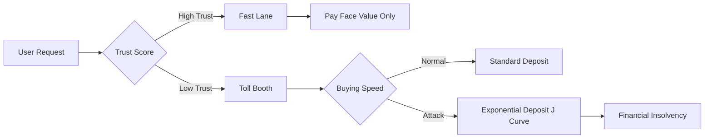

# Project UNFORGIVEN // Protocol

**A high-frequency Dutch Auction ticketing protocol powered by Variable Rate Gradual Dutch Auctions (VRGDA).**

> "We don't block scalpers; we tax them into oblivion."

## 1. Abstract

Current anti-scalping measures (KYC, CAPTCHA) attempt to solve a mechanism design problem with identity verification. This is inefficient. Project UNFORGIVEN proposes a market-based solution: using a J-curve pricing model that mathematically aligns the cost of acquisition with the velocity of sales. By turning inventory depletion into a pricing signal, we destroy the arbitrage spread that scalpers rely on.

## 2. Core Mechanism: The "Toll Road" Logic

We implement a variation of the algorithm pioneered by Paradigm. The core logic uses a **J-Curve** to penalize high-frequency bot attacks with exponential capital requirements.

```mermaid
graph LR
    A[User Request] --> B{Trust Score}
    B -- High Trust --> C[Fast Lane]
    C --> D[Pay Face Value Only]
    B -- Low Trust --> E[Toll Booth]
    E --> F{Buying Speed}
    F -- Normal --> G[Standard Deposit]
    F -- Attack --> H[Exponential Deposit J Curve]
    H --> I[Financial Insolvency]
```

### The Math

We utilize a continuous token issuance model where price $P(t)$ is a function of time $t$ and sales velocity.

$$
P(t) = P_0 (1 - k)^{t - \frac{n}{r}}
$$

Where:
- $P(t)$: Price at time $t$
- $P_0$: Initial Target Price
- $k$: Decay Constant (Scalper Tax / Price Sensitivity)
- $n$: Number of tickets sold
- $r$: Target sales rate (tickets/minute)

## 3. Project Structure

- `/contracts`: Core Solidity logic for the ERC721 Dutch Auction.
- `/whitepaper`: Theoretical basis and game theory simulations (PDF).
- `/simulation`: (Coming Soon) Python agent-based modeling for stress testing.

## 4. Roadmap (Q1 2026)

- [x] **Phase 0:** Mathematical Modeling & Whitepaper.
- [x] **Phase 1:** Core Contract Development (Solidity).
- [ ] **Phase 2:** Mainnet Deployment & Gas Optimization.
- [ ] **Phase 3:** Agent Simulation (1000+ Bot Stress Test).
- [ ] **Phase 4:** Visual Dashboard (React/Tailwind).

## 5. Contact & Grant

This project is currently applying for the **1517 Fund Medici Grant** and **Emergent Ventures** to fund the mainnet deployment and simulation costs.

**Lead Researcher:** Jiani Zhao  
**Location:** Shanghai
