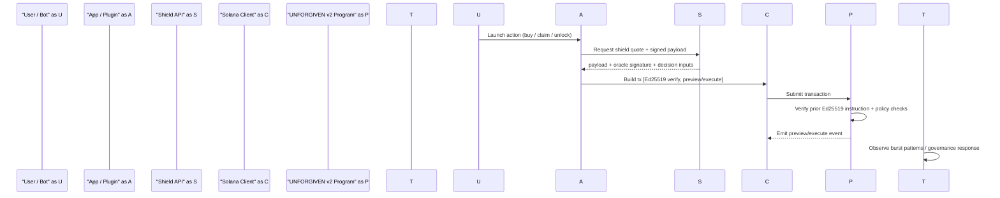

# UNFORGIVEN v2

Universal fairness middleware for high-velocity Solana launches.

UNFORGIVEN v2 combines Shield-first scoring, signed execution payloads, and on-chain verifiable checks to reduce bot extraction without forcing custom anti-bot logic into every app.

## Competition Snapshot (Eternal)

Current repo state includes:

- Shield oracle hardening (`fail-closed` policies in production)
  - rate-limit Redis unavailable => fail-closed
  - replay store Redis unavailable => fail-closed
  - provider allowlist required in production
- Hub decision engine with behavior signals
  - scenario-aware signals from telemetry summaries
  - risk signal merge into quote decisions (`allow | step_up | block`)
- Shadow-mode behavior lab (`/lab`)
  - playable story/case/daily/pressure routes
  - telemetry ingest + shadow decision record APIs
  - no user-flow blocking in lab mode
- Plugin Contract V1
  - stable output schema for integrators
  - contract tests + smoke script

## Reviewer Quick Start (Recommended)

Run this exact path:

```bash
cd "/Users/lenovo/Desktop/HACKTHON PROJECT"
npm install
npm run ci:gate
npm run build
npm run dev
```

Then open:

- `http://localhost:3000/lab`
- `http://localhost:3000/fan-pass`
- `http://localhost:3000/api/lab/shadow/records?limit=20`

## Evidence Path (Optional, 3-5 minutes)

If you want deeper technical proof quickly:

```bash
cd "/Users/lenovo/Desktop/HACKTHON PROJECT"
npm run test:shield:hardening
npm run test:hub
npm run test:plugin:ticket
SHIELD_API_BASE=http://127.0.0.1:3100 npm run smoke:plugin:ticket:v2
```

## Core Flow


```mermaid
sequenceDiagram
  participant "User / Bot" as U
  participant "App / Plugin" as A
  participant "Shield API" as S
  participant "Solana Client" as C
  participant "UNFORGIVEN v2 Program" as P
  participant "Sentinel" as T

  U->>A: Launch action (buy / claim / unlock)
  A->>S: Request shield quote + signed payload
  S-->>A: payload + oracle signature + decision inputs
  A->>C: Build tx [Ed25519 verify, preview/execute]
  C->>P: Submit transaction
  P->>P: Verify prior Ed25519 instruction + policy checks
  P-->>C: Emit preview/execute event
  T->>T: Observe burst patterns / governance response
```

## Integration Contract

Standard Shield response fields:

- `payload_hex`
- `oracle_signature_hex`
- `oracle_pubkey`

Plugin decision contract and semantics:

- `docs/v2/PLUGIN_CONTRACT_V1.md`
- `examples/anti-bot-ticket-plugin/index.js`

## Repository Map

- v2 on-chain program: `programs/unforgiven_v2`
- Shield oracle: `services/shield-oracle`
- Fan-pass hub decision layer: `services/fan-pass-hub`
- Behavior lab engine: `services/behavior-lab-engine`
- Sentinel: `crates/sentinel`
- v2 docs: `docs/v2`
- lab docs: `docs/lab`

## Docs

- v2 docs index: `docs/v2/README.md`
- execution flow: `docs/v2/EXECUTION_FLOW.md`
- ops runbook: `docs/v2/OPS_RUNBOOK.md`
